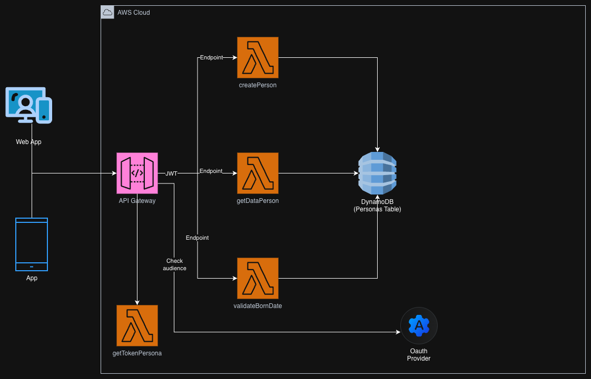

# Serverless People Management API

A high-performance microservice built on **AWS Lambda** and **DynamoDB** to manage personal records. This API handles person creation, identity validation (RUT), and record retrieval with strict data integrity rules.

## 🚀 Key Features

- **Identity Validation:** Custom logic for Chilean RUT validation (modulus 11) and date-of-birth consistency checks.
- **RESTful Endpoints:** - `POST /v1/personas`: Create or update person records.
    - `GET /v1/personas/{rut}`: Retrieve data by unique identifier.
    - `GET /v1/personas/{rut}/nacimiento/{fecha}`: Validate if a birth date matches a specific RUT.
- **Secure Token Management:** Built-in handler to generate access tokens for service-to-service communication.
- **Data Integrity:** Strict input validation for string lengths, date formats, and biological sex categories.

## 🛠️ Tech Stack

- **Language:** Python 3.7
- **Framework:** Serverless Framework v3.29.0
- **Cloud:** AWS (Lambda, HTTP API, IAM, DynamoDB)
- **CI/CD & Quality:** Pre-commit hooks (YAML check, Pylint, Unit tests)
- **Testing:** Unittest & Pytest with Coverage reporting

## 📂 Project Structure

- `functions/`: Lambda handlers for CRUD operations and validations.
- `utils/aws_resources/`: Abstraction layer for DynamoDB (CRUD and payload preparation).
- `lib/`: Standardized HTTP response library.
- `.cloudformation/`: Modularized IAM policies and Lambda function definitions.
- `openapi.yaml`: API documentation following OpenAPI 3.0 standards.

## 🏗️ Architecture Diagram


## ⚙️ Setup and Deployment

### Prerequisites
- Node.js and Serverless Framework.
- Python 3.7.
- AWS CLI configured with appropriate permissions.
- A DynamoDB table created (or use IaC to provision it).

### Installation
1. Install Node.js dependencies:
   ```bash
   npm install

2. Install Python dependencies:
   ```bash
   pip install -r requirements.txt

3. Environment Configuration:
   ```yaml
    ARN_TABLA_PERSONAS: "The full ARN for your DynamoDB table."
    ID_API: "Your AWS API Gateway ID."
    CLIENT_ID: "Credentials for token generation."
    CLIENT_SECRET: "Credentials for token generation."
    # ... other variables

4. Deployment:
   ```bash
   sls deploy -s dev

5. Testing:
   ```bash
   pytest test/test.py

Developed by benjoks.